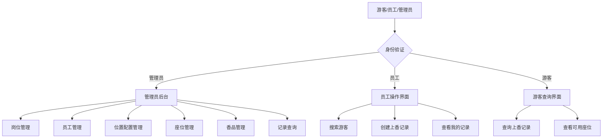
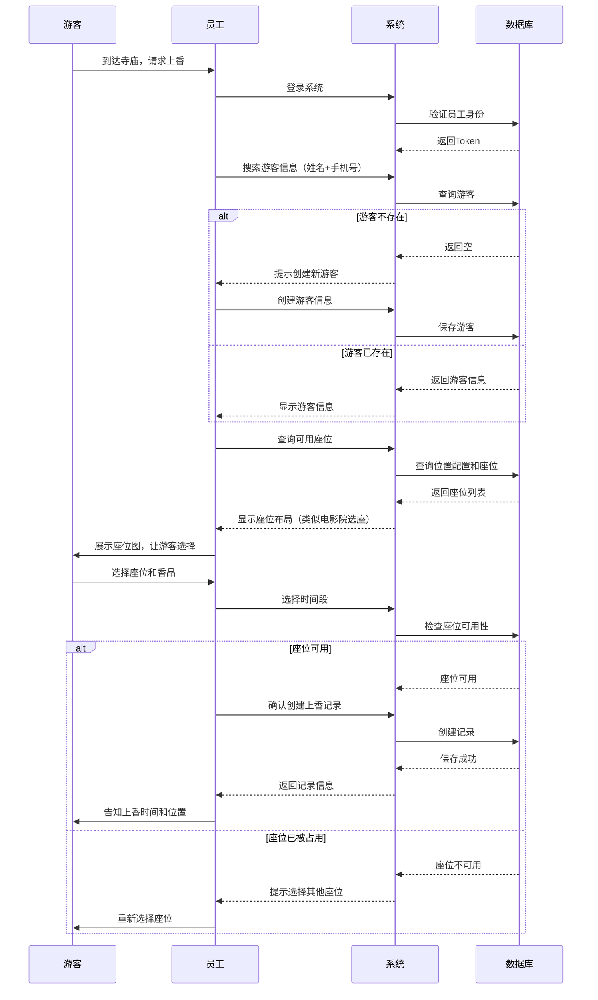
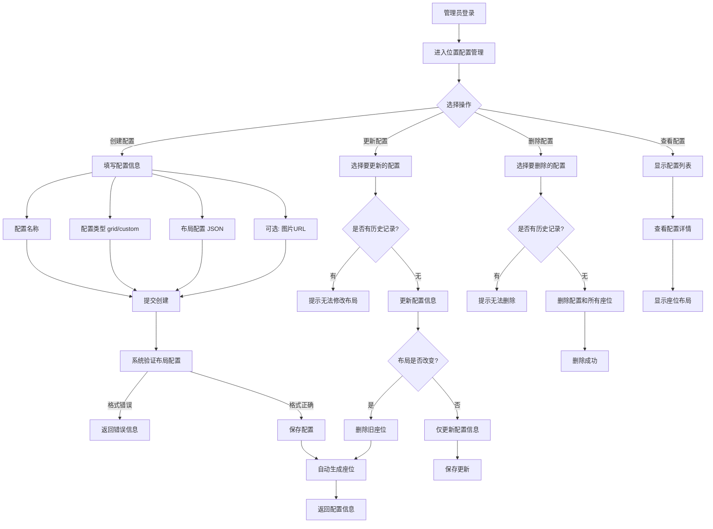
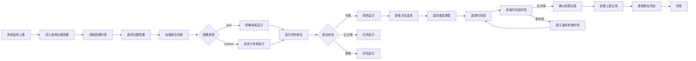
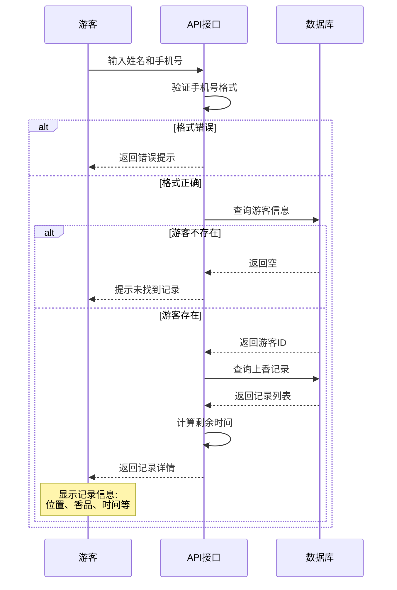
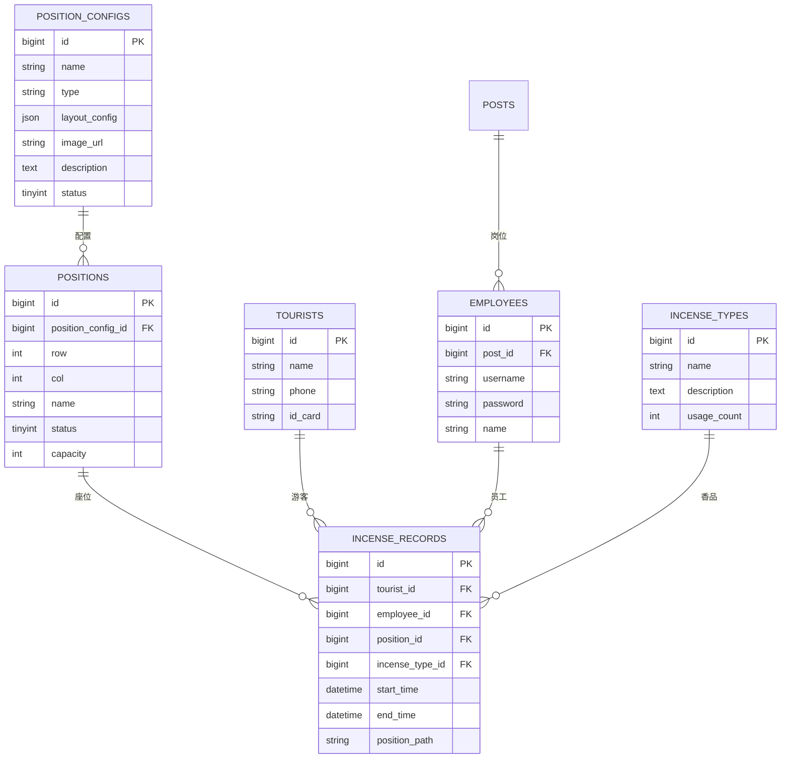
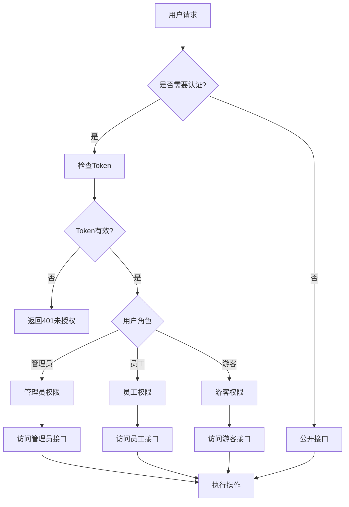
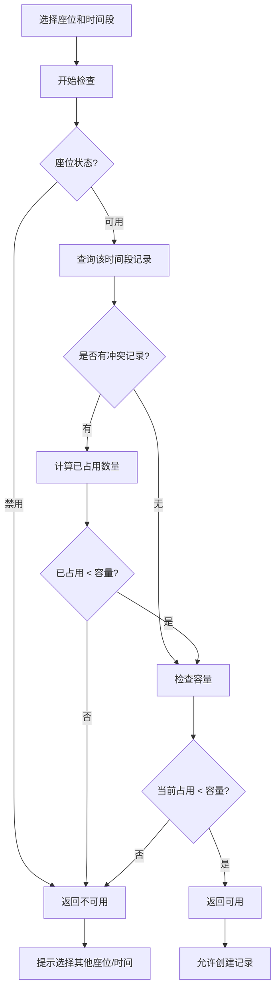

# 七曲山寺庙智能上香系统 - 流程图

## 1. 系统整体架构流程图

```mermaid
graph TB
    A[游客/员工/管理员] --> B{身份验证}
    B -->|管理员| C[管理员后台]
    B -->|员工| D[员工操作界面]
    B -->|游客| E[游客查询界面]
    
    C --> C1[岗位管理]
    C --> C2[员工管理]
    C --> C3[位置配置管理]
    C --> C4[座位管理]
    C --> C5[香品管理]
    C --> C6[记录查询]
    
    D --> D1[搜索游客]
    D --> D2[创建上香记录]
    D --> D3[查看我的记录]
    
    E --> E1[查询上香记录]
    E --> E2[查看可用座位]
```

## 2. 上香业务流程流程图

```mermaid
sequenceDiagram
    participant T as 游客
    participant E as 员工
    participant S as 系统
    participant DB as 数据库
    
    T->>E: 到达寺庙，请求上香
    E->>S: 登录系统
    S->>DB: 验证员工身份
    DB-->>S: 返回Token
    
    E->>S: 搜索游客信息（姓名+手机号）
    S->>DB: 查询游客
    alt 游客不存在
        DB-->>S: 返回空
        S-->>E: 提示创建新游客
        E->>S: 创建游客信息
        S->>DB: 保存游客
    else 游客已存在
        DB-->>S: 返回游客信息
        S-->>E: 显示游客信息
    end
    
    E->>S: 查询可用座位
    S->>DB: 查询位置配置和座位
    DB-->>S: 返回座位列表
    S-->>E: 显示座位布局（类似电影院选座）
    
    E->>T: 展示座位图，让游客选择
    T->>E: 选择座位和香品
    E->>S: 选择时间段
    S->>DB: 检查座位可用性
    alt 座位可用
        DB-->>S: 座位可用
        E->>S: 确认创建上香记录
        S->>DB: 创建记录
        DB-->>S: 保存成功
        S-->>E: 返回记录信息
        E->>T: 告知上香时间和位置
    else 座位已被占用
        DB-->>S: 座位不可用
        S-->>E: 提示选择其他座位
        E->>T: 重新选择座位
    end
```

## 3. 位置配置管理流程图

```mermaid
flowchart TD
    A[管理员登录] --> B[进入位置配置管理]
    B --> C{选择操作}
    
    C -->|创建配置| D[填写配置信息]
    D --> D1[配置名称]
    D --> D2[配置类型 grid/custom]
    D --> D3[布局配置 JSON]
    D --> D4[可选: 图片URL]
    D1 --> E[提交创建]
    D2 --> E
    D3 --> E
    D4 --> E
    
    E --> F[系统验证布局配置]
    F -->|格式错误| G[返回错误信息]
    F -->|格式正确| H[保存配置]
    H --> I[自动生成座位]
    I --> J[返回配置信息]
    
    C -->|更新配置| K[选择要更新的配置]
    K --> L{是否有历史记录?}
    L -->|有| M[提示无法修改布局]
    L -->|无| N[更新配置信息]
    N --> O{布局是否改变?}
    O -->|是| P[删除旧座位]
    O -->|否| Q[仅更新配置信息]
    P --> I
    Q --> R[保存更新]
    
    C -->|删除配置| S[选择要删除的配置]
    S --> T{是否有历史记录?}
    T -->|有| U[提示无法删除]
    T -->|无| V[删除配置和所有座位]
    V --> W[删除成功]
    
    C -->|查看配置| X[显示配置列表]
    X --> Y[查看配置详情]
    Y --> Z[显示座位布局]
```

## 4. 座位选择流程图

```mermaid
flowchart LR
    A[游客选择上香] --> B[员工查询位置配置]
    B --> C[获取配置列表]
    C --> D[选择位置配置]
    D --> E[加载座位布局]
    
    E --> F{配置类型}
    F -->|grid| G[网格布局显示]
    F -->|custom| H[自定义布局显示]
    
    G --> I[显示所有座位]
    H --> I
    
    I --> J{座位状态}
    J -->|可用| K[绿色显示]
    J -->|已占用| L[红色显示]
    J -->|禁用| M[灰色显示]
    
    K --> N[游客点击选择]
    N --> O[选择香品类型]
    O --> P[选择时间段]
    P --> Q[检查时间段冲突]
    
    Q -->|无冲突| R[确认创建记录]
    Q -->|有冲突| S[提示选择其他时间]
    S --> P
    
    R --> T[创建上香记录]
    T --> U[更新座位状态]
    U --> V[完成]
```

## 5. 游客查询记录流程图

```mermaid
sequenceDiagram
    participant T as 游客
    participant API as API接口
    participant DB as 数据库
    
    T->>API: 输入姓名和手机号
    API->>API: 验证手机号格式
    alt 格式错误
        API-->>T: 返回错误提示
    else 格式正确
        API->>DB: 查询游客信息
        alt 游客不存在
            DB-->>API: 返回空
            API-->>T: 提示未找到记录
        else 游客存在
            DB-->>API: 返回游客ID
            API->>DB: 查询上香记录
            DB-->>API: 返回记录列表
            API->>API: 计算剩余时间
            API-->>T: 返回记录详情
            Note over T: 显示记录信息:<br/>位置、香品、时间等
        end
    end
```

## 6. 数据库关系流程图

```mermaid
erDiagram
    POSITION_CONFIGS ||--o{ POSITIONS : "配置"
    POSITIONS ||--o{ INCENSE_RECORDS : "座位"
    TOURISTS ||--o{ INCENSE_RECORDS : "游客"
    EMPLOYEES ||--o{ INCENSE_RECORDS : "员工"
    INCENSE_TYPES ||--o{ INCENSE_RECORDS : "香品"
    POSTS ||--o{ EMPLOYEES : "岗位"
    
    POSITION_CONFIGS {
        bigint id PK
        string name
        string type
        json layout_config
        string image_url
        text description
        tinyint status
    }
    
    POSITIONS {
        bigint id PK
        bigint position_config_id FK
        int row
        int col
        string name
        tinyint status
        int capacity
    }
    
    INCENSE_RECORDS {
        bigint id PK
        bigint tourist_id FK
        bigint employee_id FK
        bigint position_id FK
        bigint incense_type_id FK
        datetime start_time
        datetime end_time
        string position_path
    }
    
    TOURISTS {
        bigint id PK
        string name
        string phone
        string id_card
    }
    
    EMPLOYEES {
        bigint id PK
        bigint post_id FK
        string username
        string password
        string name
    }
    
    INCENSE_TYPES {
        bigint id PK
        string name
        text description
        int usage_count
    }
```

## 7. 认证授权流程图

```mermaid
flowchart TD
    A[用户请求] --> B{是否需要认证?}
    B -->|否| C[公开接口]
    B -->|是| D[检查Token]
    
    D --> E{Token有效?}
    E -->|否| F[返回401未授权]
    E -->|是| G{用户角色}
    
    G -->|管理员| H[管理员权限]
    G -->|员工| I[员工权限]
    G -->|游客| J[游客权限]
    
    H --> K[访问管理员接口]
    I --> L[访问员工接口]
    J --> M[访问游客接口]
    
    K --> N[执行操作]
    L --> N
    M --> N
    
    C --> N
```

## 8. 座位可用性检查流程图

```mermaid
flowchart TD
    A[选择座位和时间段] --> B[开始检查]
    B --> C{座位状态?}
    C -->|禁用| D[返回不可用]
    C -->|可用| E[查询该时间段记录]
    
    E --> F{是否有冲突记录?}
    F -->|无| G[检查容量]
    F -->|有| H[计算已占用数量]
    
    H --> I{已占用 < 容量?}
    I -->|是| G
    I -->|否| D
    
    G --> J{当前占用 < 容量?}
    J -->|是| K[返回可用]
    J -->|否| D
    
    K --> L[允许创建记录]
    D --> M[提示选择其他座位/时间]
```

